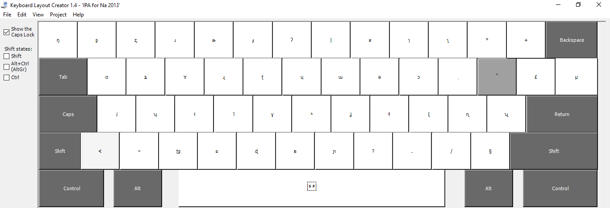

keyboards
================================
Keyboards for inputting International Phonetic Alphabet for the Yongning Na language (nɑ˩-ʐwɤ˥, also known as *Narua* or *Mosuo*). 

To install the one designed with Microsoft Keyboard Layout Creator (MKLC), it is simplest to download all the files into a single folder then double-click the ``setup.exe`` file. 

Here is a view of the correspondences between keys and characters.

With SHIFT key pressed:

For GNU Linux users, a tutorial (in French) by Maxime Fily is available `here <https://lacito.hypotheses.org/3086>`_.
