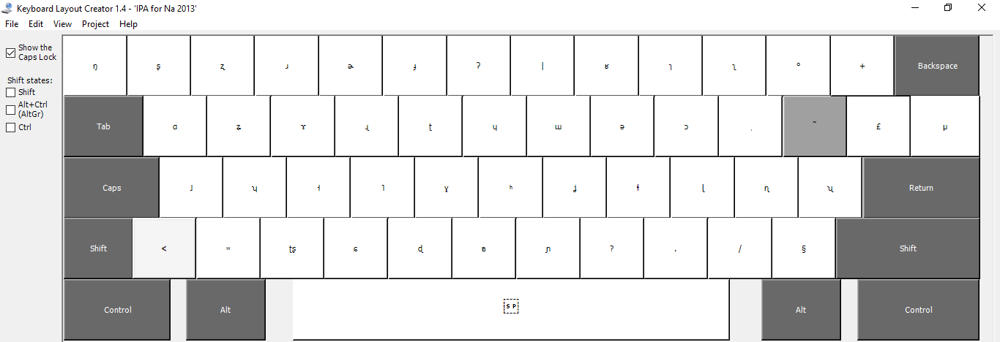

Windows keyboard
================================
A keyboard for inputting International Phonetic Alphabet for the Yongning Na language (nɑ˩-ʐwɤ˥, also known as *Narua* or *Mosuo*). 

It was designed with Microsoft Keyboard Layout Creator (MKLC).

To install, it is simplest to download all the files into a single folder then double-click the ``setup.exe`` file. 

Here is a view of the correspondences between keys and characters.

With SHIFT key pressed:

